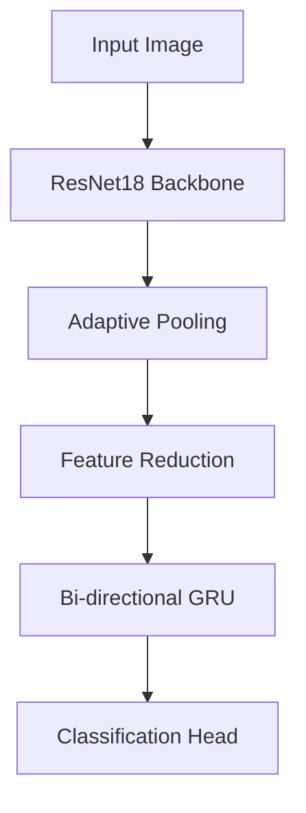
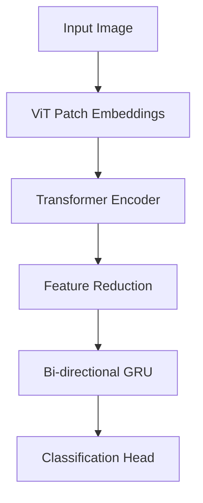
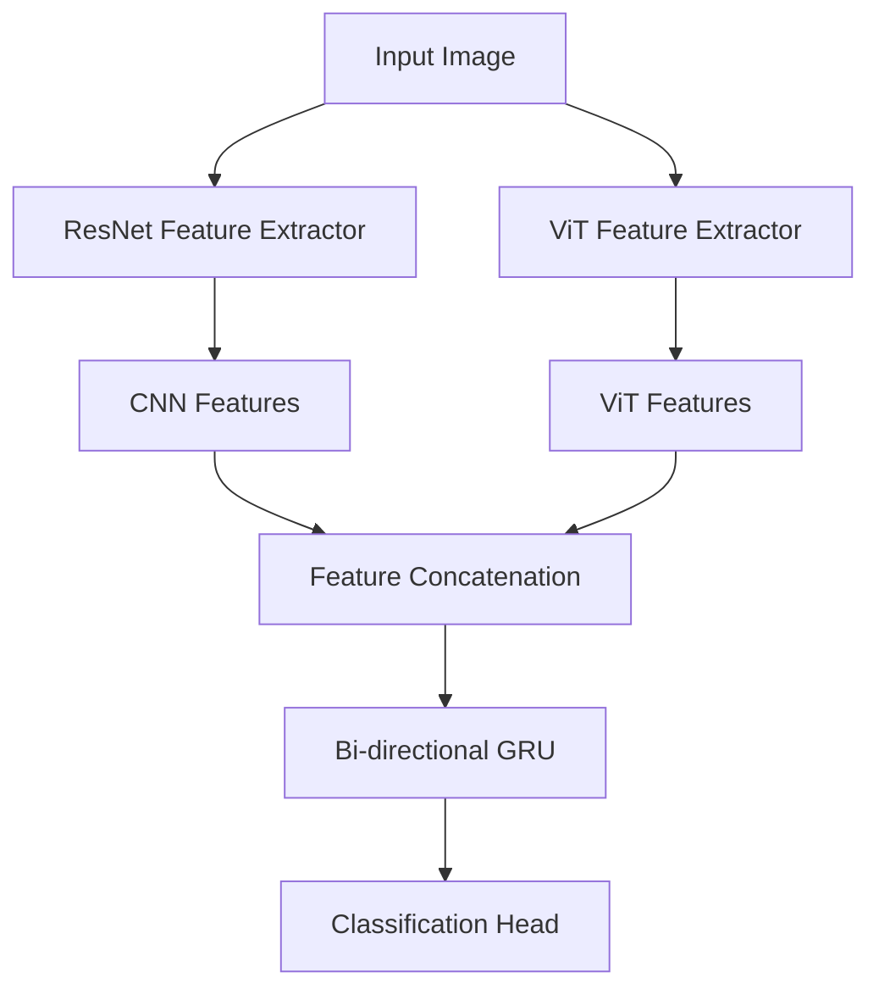

# Bengali OCR with Deep Learning


## 📌 Overview
This project implements state-of-the-art OCR models for recognizing Bengali text from images. We compare three different architectures:
1. **ResNet + GRU** - CNN backbone with recurrent layers
2. **Vision Transformer (ViT)** - Transformer-based approach
3. **Hybrid (ResNet + ViT)** - Combining both architectures

## 🏗️ Architecture

### 1. ResNet + GRU Model

### 2. Vision Transformer Model (ViT)

### 3. Hybrid Model



## 🚀 Feature
1. Supports complex Bengali characters including conjuncts
2. Advanced data augmentation techniques
3. Three different model architectures
4. CTC loss for sequence recognition
5. CER (Character Error Rate) evaluation

## 🛠️ Installation
```bash
git clone https://github.com/yourusername/bengali-ocr.git
cd bengali-ocr
pip install -r requirements.txt
```

## 🏃‍♂️ Training
```bash
python scripts/train_model.py --model resnet --data_path /path/to/data
```
### Custom training parameters
```bash
python scripts/train_model.py --model hybrid \
  --data_path /custom/data/path \
  --batch_size 128 \
  --epochs 30 \
  --lr 0.0001 \
  --max_samples 500000
```

## 📝 Evaluation
```bash
python scripts/evaluate.py --model_path best_model.pth --model_type resnet
```
### Custom evaluation
```bash
python scripts/evaluate.py \
  --model_path best_hybrid_model.pth \
  --model_type hybrid \
  --data_path /custom/test/data \
  --max_samples 1000 \
  --no_visualize
```

## Testing
```bash
python -m unittest discover -s tests
```

## Project Structure
```text
bengali-ocr/
├── bengali_ocr/              
│   ├── __init__.py
│   ├── config.py             # Configuration settings
│   ├── dataset.py            # Dataset loading
│   ├── models.py             # Model architectures
│   ├── train.py              # Training logic
│   ├── utils.py              # Utility functions
│   └── augmentations.py      # Data augmentation
├── scripts/                  # Runnable scripts
│   ├── train_model.py        # Training entry point
│   └── evaluate.py           # Evaluation entry point
├── tests/                    # Unit tests
│   └── test_models.py        # Model tests
├── requirements.txt          # Dependencies
└── README.md                 # This document
```

## 📂 Dataset Format
```bash
123_বাংলা.jpg
456_ভাষা.jpg
```

## 🤝 Contribution
Contributions are welcome! Please open an issue or submit a pull request.

#### Don't use the data_1M dataset as its only for testing purpose, Use the below given link for the original dataset
https://www.kaggle.com/datasets/mnsm92/bengali-ocr-dataset-1m